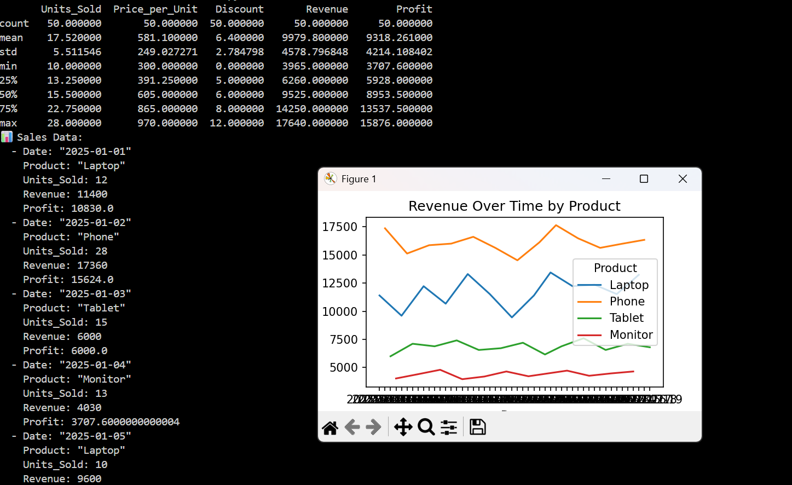

[](LICENSE)  
[]()

<p align="center">
- A Python project that uses <b>Pandas</b> to analyze performance over a given time period. -
</p>

## 📂 Project Overview

This project demonstrates:
- How to create and load a dataset with Pandas
- How to compute descriptive statistics for data
- How to structure small data analysis scripts for GitHub

## 🚀 Features
- Load data from a dictionary or CSV file
- Display tabular data
- Generate summary statistics with `pandas.DataFrame.describe()`

## 🧰 Requirements
Install dependencies with:
```bash
pip install -r requirements.txt
```

## ▶️ Usage
Run the script:
```bash
python src/analyze_sales.py
```
Output includes:
- The sales dataset table
- Statistical summary (mean, std, min, max, etc.)

## 📈 Example Output




## 🧩 Future Improvements

- Add regional performance breakdowns
- Export reports as Excel or PDF
- Build an interactive dashboard with Plotly or Streamlit

## 🧑‍💻 Author
Joshua Johnson — Machine Learning Trainee & Python Developer


## Contact
All Rights Reserved under Mr Joshua Johnson (@johnsonjoshua16) <br>
Machine Learning Trainee and Python Developer. <br>
London, UK. <br>
Feel free to open an issue or submit a PR if you'd like to contribute or suggest improvements!
